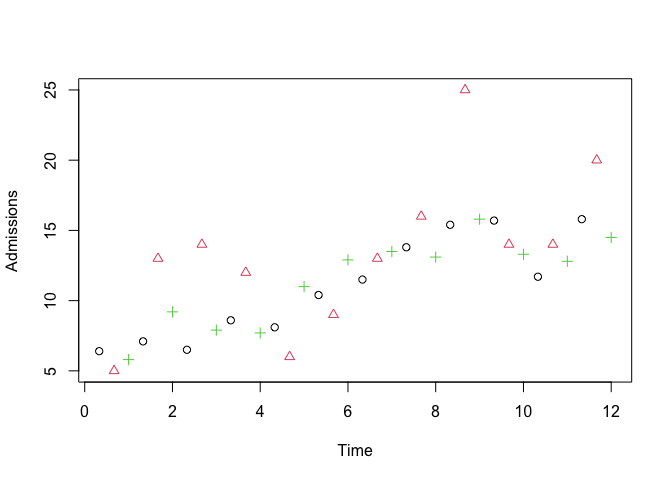
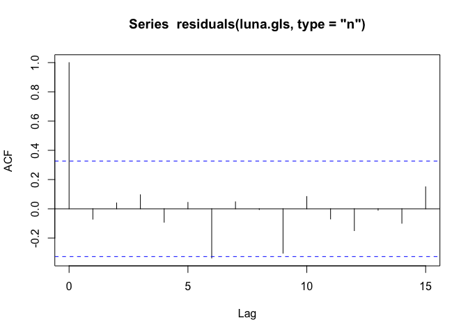
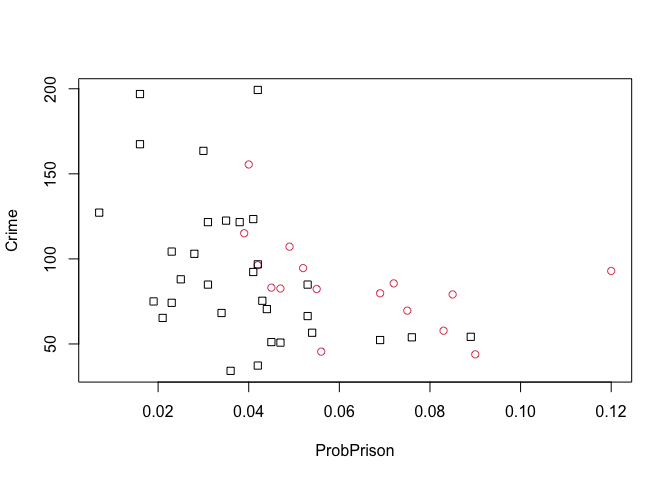
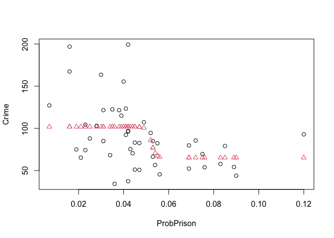
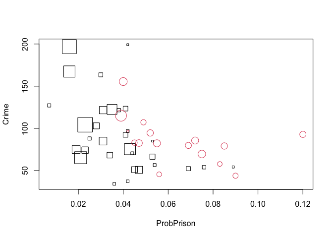

Analyzing Crime Rates and Punishment Variables in U.S. States
================
Nazgul Altynbekova

### 1

Criminologists are interested in the effect of punishment regimes on
crime rates. The dataset CrimeandPunishment.csv has information on the
Crime rate in 47 states of the USA, and certain other variables for each
state. A description of the variables is given in a table at the end of
this report.

``` r
CAP <- read.csv("CrimeAndPunishment.csv",header=TRUE)
attach(CAP)
cap.lm = lm(Crime ~ ., data = CAP)
summary(cap.lm)
```

    ## 
    ## Call:
    ## lm(formula = Crime ~ ., data = CAP)
    ## 
    ## Residuals:
    ##     Min      1Q  Median      3Q     Max 
    ## -39.517  -9.802  -0.810  11.315  51.157 
    ## 
    ## Coefficients:
    ##                Estimate Std. Error t value Pr(>|t|)    
    ## (Intercept)  -5.990e+02  1.626e+02  -3.683 0.000874 ***
    ## yMalepc       8.774e+00  4.170e+00   2.104 0.043600 *  
    ## South        -5.539e-01  1.486e+01  -0.037 0.970503    
    ## Education     1.884e+01  6.207e+00   3.035 0.004833 ** 
    ## Police60pc    1.939e+01  1.062e+01   1.826 0.077460 .  
    ## Police59pc   -1.108e+01  1.176e+01  -0.942 0.353428    
    ## yLabourF     -6.732e+01  1.470e+02  -0.458 0.650107    
    ## Mper100F      1.751e+00  2.035e+00   0.861 0.396114    
    ## Population   -7.333e-02  1.289e-01  -0.569 0.573567    
    ## NonWhitepc    4.314e-01  6.494e-01   0.664 0.511380    
    ## yUnemplmt    -5.848e+02  4.209e+02  -1.389 0.174657    
    ## Unemplmt3     1.685e+01  8.231e+00   2.047 0.049193 *  
    ## Wealth        9.677e-03  1.036e-02   0.934 0.357499    
    ## Inequality    7.071e+00  2.271e+00   3.114 0.003950 ** 
    ## ProbPrison   -4.863e+02  2.271e+02  -2.141 0.040217 *  
    ## TimeinPrison -3.531e-01  7.173e-01  -0.492 0.625971    
    ## ---
    ## Signif. codes:  0 '***' 0.001 '**' 0.01 '*' 0.05 '.' 0.1 ' ' 1
    ## 
    ## Residual standard error: 20.9 on 31 degrees of freedom
    ## Multiple R-squared:  0.8032, Adjusted R-squared:  0.708 
    ## F-statistic: 8.435 on 15 and 31 DF,  p-value: 3.511e-07

The model is definitely overfitting since only 5 out f 15 variables are
more or less significant. Hence the RSE is relatively huge, even though
the R-squared is quite acceptable, as expected considering big number of
covariates.

#### Calculating VIFs

``` r
library(car)
```

    ## Loading required package: carData

``` r
vif(cap.lm)
```

    ##      yMalepc        South    Education   Police60pc   Police59pc     yLabourF 
    ##     2.892796     5.334118     5.077678   104.874359   113.862998     3.714649 
    ##     Mper100F   Population   NonWhitepc    yUnemplmt    Unemplmt3       Wealth 
    ##     3.785027     2.536628     4.695681     6.064922     5.088505    10.524271 
    ##   Inequality   ProbPrison TimeinPrison 
    ##     8.641642     2.810773     2.720826

We got 2 variables (Police60pc and Police59pc) with large value of VIFs
over 100, and one variable with VIF above 10 (Wealth), which clearly
indicates that we deal with multicollinearity.

#### Performing a backwards elimination starting with the model

``` r
cap.stepback = step(cap.lm, scope = ~1, data = CAP, direction = "backward")
```

    ## Start:  AIC=298.18
    ## Crime ~ yMalepc + South + Education + Police60pc + Police59pc + 
    ##     yLabourF + Mper100F + Population + NonWhitepc + yUnemplmt + 
    ##     Unemplmt3 + Wealth + Inequality + ProbPrison + TimeinPrison
    ## 
    ##                Df Sum of Sq   RSS    AIC
    ## - South         1       0.6 13542 296.18
    ## - yLabourF      1      91.7 13633 296.50
    ## - TimeinPrison  1     105.9 13648 296.55
    ## - Population    1     141.3 13683 296.67
    ## - NonWhitepc    1     192.8 13735 296.84
    ## - Mper100F      1     323.5 13865 297.29
    ## - Wealth        1     381.1 13923 297.48
    ## - Police59pc    1     387.7 13930 297.51
    ## <none>                      13542 298.18
    ## - yUnemplmt     1     843.1 14385 299.02
    ## - Police60pc    1    1456.9 14999 300.98
    ## - Unemplmt3     1    1830.8 15373 302.14
    ## - yMalepc       1    1933.5 15475 302.45
    ## - ProbPrison    1    2003.0 15545 302.66
    ## - Education     1    4024.9 17567 308.41
    ## - Inequality    1    4236.7 17778 308.97
    ## 
    ## Step:  AIC=296.18
    ## Crime ~ yMalepc + Education + Police60pc + Police59pc + yLabourF + 
    ##     Mper100F + Population + NonWhitepc + yUnemplmt + Unemplmt3 + 
    ##     Wealth + Inequality + ProbPrison + TimeinPrison
    ## 
    ##                Df Sum of Sq   RSS    AIC
    ## - TimeinPrison  1     105.6 13648 294.55
    ## - yLabourF      1     109.2 13652 294.56
    ## - Population    1     141.4 13684 294.67
    ## - NonWhitepc    1     223.5 13766 294.95
    ## - Mper100F      1     326.9 13869 295.30
    ## - Police59pc    1     387.4 13930 295.51
    ## - Wealth        1     395.0 13937 295.53
    ## <none>                      13542 296.18
    ## - yUnemplmt     1     964.9 14507 297.42
    ## - Police60pc    1    1456.4 14999 298.98
    ## - Unemplmt3     1    1909.6 15452 300.38
    ## - yMalepc       1    1944.5 15487 300.49
    ## - ProbPrison    1    2051.9 15594 300.81
    ## - Education     1    4033.4 17576 306.43
    ## - Inequality    1    4879.3 18422 308.64
    ## 
    ## Step:  AIC=294.55
    ## Crime ~ yMalepc + Education + Police60pc + Police59pc + yLabourF + 
    ##     Mper100F + Population + NonWhitepc + yUnemplmt + Unemplmt3 + 
    ##     Wealth + Inequality + ProbPrison
    ## 
    ##              Df Sum of Sq   RSS    AIC
    ## - yLabourF    1     105.6 13754 292.91
    ## - NonWhitepc  1     159.8 13808 293.09
    ## - Population  1     219.3 13867 293.30
    ## - Police59pc  1     295.0 13943 293.55
    ## - Wealth      1     362.8 14011 293.78
    ## - Mper100F    1     420.9 14069 293.97
    ## <none>                    13648 294.55
    ## - yUnemplmt   1     914.2 14562 295.59
    ## - Police60pc  1    1352.6 15001 296.99
    ## - Unemplmt3   1    1850.6 15499 298.52
    ## - yMalepc     1    1853.8 15502 298.53
    ## - ProbPrison  1    2380.1 16028 300.10
    ## - Education   1    4096.6 17745 304.88
    ## - Inequality  1    5022.7 18671 307.27
    ## 
    ## Step:  AIC=292.91
    ## Crime ~ yMalepc + Education + Police60pc + Police59pc + Mper100F + 
    ##     Population + NonWhitepc + yUnemplmt + Unemplmt3 + Wealth + 
    ##     Inequality + ProbPrison
    ## 
    ##              Df Sum of Sq   RSS    AIC
    ## - NonWhitepc  1     121.0 13875 291.32
    ## - Police59pc  1     219.0 13973 291.65
    ## - Population  1     279.0 14033 291.85
    ## - Mper100F    1     315.3 14069 291.97
    ## - Wealth      1     352.3 14106 292.10
    ## <none>                    13754 292.91
    ## - yUnemplmt   1     809.3 14563 293.60
    ## - Police60pc  1    1249.7 15003 295.00
    ## - Unemplmt3   1    1916.3 15670 297.04
    ## - yMalepc     1    2169.8 15924 297.79
    ## - ProbPrison  1    2274.5 16028 298.10
    ## - Education   1    4134.3 17888 303.26
    ## - Inequality  1    5003.3 18757 305.49
    ## 
    ## Step:  AIC=291.32
    ## Crime ~ yMalepc + Education + Police60pc + Police59pc + Mper100F + 
    ##     Population + yUnemplmt + Unemplmt3 + Wealth + Inequality + 
    ##     ProbPrison
    ## 
    ##              Df Sum of Sq   RSS    AIC
    ## - Police59pc  1     170.3 14045 289.89
    ## - Population  1     258.2 14133 290.19
    ## - Mper100F    1     269.5 14144 290.23
    ## - Wealth      1     316.8 14192 290.38
    ## <none>                    13875 291.32
    ## - yUnemplmt   1     839.1 14714 292.08
    ## - Police60pc  1    1192.3 15067 293.19
    ## - Unemplmt3   1    2024.4 15899 295.72
    ## - ProbPrison  1    2168.2 16043 296.14
    ## - yMalepc     1    3094.0 16969 298.78
    ## - Education   1    4026.4 17901 301.30
    ## - Inequality  1    5900.0 19775 305.97
    ## 
    ## Step:  AIC=289.89
    ## Crime ~ yMalepc + Education + Police60pc + Mper100F + Population + 
    ##     yUnemplmt + Unemplmt3 + Wealth + Inequality + ProbPrison
    ## 
    ##              Df Sum of Sq   RSS    AIC
    ## - Population  1     223.2 14268 288.63
    ## - Wealth      1     323.1 14368 288.96
    ## - Mper100F    1     371.1 14416 289.12
    ## <none>                    14045 289.89
    ## - yUnemplmt   1     864.2 14909 290.70
    ## - Unemplmt3   1    2068.5 16113 294.35
    ## - ProbPrison  1    2183.4 16228 294.69
    ## - yMalepc     1    3071.8 17117 297.19
    ## - Education   1    3892.2 17937 299.39
    ## - Inequality  1    6090.4 20135 304.82
    ## - Police60pc  1   10508.8 24554 314.15
    ## 
    ## Step:  AIC=288.63
    ## Crime ~ yMalepc + Education + Police60pc + Mper100F + yUnemplmt + 
    ##     Unemplmt3 + Wealth + Inequality + ProbPrison
    ## 
    ##              Df Sum of Sq   RSS    AIC
    ## - Wealth      1     266.4 14534 287.50
    ## <none>                    14268 288.63
    ## - Mper100F    1     849.1 15117 289.35
    ## - yUnemplmt   1     995.1 15263 289.80
    ## - ProbPrison  1    1983.4 16252 292.75
    ## - Unemplmt3   1    2098.4 16366 293.08
    ## - yMalepc     1    3210.8 17479 296.17
    ## - Education   1    3865.1 18133 297.90
    ## - Inequality  1    5952.7 20221 303.02
    ## - Police60pc  1   11282.9 25551 314.02
    ## 
    ## Step:  AIC=287.5
    ## Crime ~ yMalepc + Education + Police60pc + Mper100F + yUnemplmt + 
    ##     Unemplmt3 + Inequality + ProbPrison
    ## 
    ##              Df Sum of Sq   RSS    AIC
    ## <none>                    14534 287.50
    ## - Mper100F    1    1037.2 15572 288.74
    ## - yUnemplmt   1    1271.7 15806 289.45
    ## - ProbPrison  1    2476.0 17010 292.90
    ## - Unemplmt3   1    2568.0 17102 293.15
    ## - yMalepc     1    2968.5 17503 294.24
    ## - Education   1    4456.0 18990 298.07
    ## - Inequality  1    7382.7 21917 304.81
    ## - Police60pc  1   16749.8 31284 321.53

``` r
summary(cap.stepback)
```

    ## 
    ## Call:
    ## lm(formula = Crime ~ yMalepc + Education + Police60pc + Mper100F + 
    ##     yUnemplmt + Unemplmt3 + Inequality + ProbPrison, data = CAP)
    ## 
    ## Residuals:
    ##     Min      1Q  Median      3Q     Max 
    ## -44.477 -11.133   0.219  12.232  48.262 
    ## 
    ## Coefficients:
    ##             Estimate Std. Error t value Pr(>|t|)    
    ## (Intercept) -643.435    119.461  -5.386 3.95e-06 ***
    ## yMalepc        9.333      3.350   2.786  0.00828 ** 
    ## Education     18.009      5.276   3.413  0.00154 ** 
    ## Police60pc    10.272      1.552   6.618 8.13e-08 ***
    ## Mper100F       2.240      1.360   1.647  0.10785    
    ## yUnemplmt   -608.960    333.967  -1.823  0.07611 .  
    ## Unemplmt3     18.783      7.249   2.591  0.01350 *  
    ## Inequality     6.134      1.396   4.393 8.65e-05 ***
    ## ProbPrison  -378.752    148.863  -2.544  0.01514 *  
    ## ---
    ## Signif. codes:  0 '***' 0.001 '**' 0.01 '*' 0.05 '.' 0.1 ' ' 1
    ## 
    ## Residual standard error: 19.56 on 38 degrees of freedom
    ## Multiple R-squared:  0.7888, Adjusted R-squared:  0.7443 
    ## F-statistic: 17.74 on 8 and 38 DF,  p-value: 1.165e-10

``` r
cap.stepback2 <- update(cap.stepback, . ~ . - Mper100F)
summary(cap.stepback2)
```

    ## 
    ## Call:
    ## lm(formula = Crime ~ yMalepc + Education + Police60pc + yUnemplmt + 
    ##     Unemplmt3 + Inequality + ProbPrison, data = CAP)
    ## 
    ## Residuals:
    ##     Min      1Q  Median      3Q     Max 
    ## -52.099 -10.597   1.025  13.595  51.888 
    ## 
    ## Coefficients:
    ##             Estimate Std. Error t value Pr(>|t|)    
    ## (Intercept) -510.025     89.701  -5.686 1.41e-06 ***
    ## yMalepc       10.682      3.319   3.219  0.00259 ** 
    ## Education     21.853      4.834   4.520 5.61e-05 ***
    ## Police60pc    10.603      1.572   6.743 4.83e-08 ***
    ## yUnemplmt   -353.864    302.293  -1.171  0.24886    
    ## Unemplmt3     15.922      7.190   2.214  0.03272 *  
    ## Inequality     6.635      1.392   4.766 2.62e-05 ***
    ## ProbPrison  -371.780    152.034  -2.445  0.01909 *  
    ## ---
    ## Signif. codes:  0 '***' 0.001 '**' 0.01 '*' 0.05 '.' 0.1 ' ' 1
    ## 
    ## Residual standard error: 19.98 on 39 degrees of freedom
    ## Multiple R-squared:  0.7737, Adjusted R-squared:  0.7331 
    ## F-statistic: 19.05 on 7 and 39 DF,  p-value: 8.906e-11

Although RSE for the second model slightly increased compared to the
fierst one (19.98 vs. 19.56) and R-squared decreased (0.7737
vs. 0.7888), the overall p-value of this model shows a bit of
improvement of the model in general (8.906e-11 vs. 1.165e-10).

``` r
pred_r_squared <- function(linear.model) {
    #' Use anova() to get the sum of squares for the linear model
    lm.anova <- anova(linear.model)
    #' Calculate the total sum of squares
    tss <- sum(lm.anova$"Sum Sq")
    # Calculate the predictive R^2
    pred.r.squared <- 1 - PRESS(linear.model)/(tss)
    return(pred.r.squared)
}

pred_r_squared(cap.stepback)
pred_r_squared(cap.stepback2)
```

First model gives slightly bigger Predicted R-square, which means that
the amount of variation in new data would be explained better by model
cap.stepback compared to cap.stepback2. Although its overall p-value is
smaller, I would suggest that the first model works better since the RSE
and R-squared are better here, plus the predicted R-squared showed the
pivotal evidence.

### 2

Tradition states that some people (so-called “lunatics”) are more likely
to become mentally unstable at the time of the full moon. To examine
whether there was any truth to this tradition, a researcher examined the
admission rates to the emergency room of a Virginia mental health clinic
before, during and after the 12 full moons from August 1971 to July
1972.

#### Admissions against time

``` r
luna <- read.csv("Lunatics.csv",header=TRUE)
attach(luna)
head(luna)
```

    ##   Time Month   Moon Admissions Before During After
    ## 1 0.33   Aug Before        6.4      1      0     0
    ## 2 0.67   Aug During        5.0      0      1     0
    ## 3 1.00   Aug  After        5.8      0      0     1
    ## 4 1.33   Sep Before        7.1      1      0     0
    ## 5 1.67   Sep During       13.0      0      1     0
    ## 6 2.00   Sep  After        9.2      0      0     1

``` r
#luna.lm = lm(Admissions ~ Time, data = luna)
#summary(luna.lm)
plot(Admissions ~ Time, pch = rep(c(1,2,3), 12), col = rep(c(1,2,3), 12), data = luna)
```

<!-- -->

``` r
luna.lm = lm(Admissions ~ Time + During, data = luna)
summary(luna.lm)
```

    ## 
    ## Call:
    ## lm(formula = Admissions ~ Time + During, data = luna)
    ## 
    ## Residuals:
    ##     Min      1Q  Median      3Q     Max 
    ## -6.1101 -1.5173  0.1188  1.6084  9.4057 
    ## 
    ## Coefficients:
    ##             Estimate Std. Error t value Pr(>|t|)    
    ## (Intercept)   5.8175     1.0063   5.781 1.84e-06 ***
    ## Time          0.8711     0.1345   6.477 2.38e-07 ***
    ## During        2.2248     0.9878   2.252   0.0311 *  
    ## ---
    ## Signif. codes:  0 '***' 0.001 '**' 0.01 '*' 0.05 '.' 0.1 ' ' 1
    ## 
    ## Residual standard error: 2.794 on 33 degrees of freedom
    ## Multiple R-squared:  0.5877, Adjusted R-squared:  0.5628 
    ## F-statistic: 23.52 on 2 and 33 DF,  p-value: 4.469e-07

The mean number of Admissions before and after the full moon is 5.8. The
effect of Time on the number of Admissions is highly significant and
shows a positive trend, which means that the number of Admissions goes
up by 0.87 every unit of Time (every month). The effect of the full moon
is also significant with p-value of 0.03, and the mean number of
Admissions increase by 2.2 During the full moon.

#### Durbin-Watson test for autocorrelation

``` r
library(car)
dwt(luna.lm, alternative = "positive")
```

    ##  lag Autocorrelation D-W Statistic p-value
    ##    1       0.2555234      1.476453   0.053
    ##  Alternative hypothesis: rho > 0

The p-value of Durbin-Watson test is significant, therefore wee reject
the null hypothesis and may conclude that residuals are positively
autocorrelated.

``` r
library(nlme)
luna.gls <- gls(Admissions ~ Time + During, correlation = corAR1(), data = luna)
summary(luna.gls)
```

    ## Generalized least squares fit by REML
    ##   Model: Admissions ~ Time + During 
    ##   Data: luna 
    ##       AIC      BIC  logLik
    ##   180.084 187.5665 -85.042
    ## 
    ## Correlation Structure: AR(1)
    ##  Formula: ~1 
    ##  Parameter estimate(s):
    ##       Phi 
    ## 0.3095481 
    ## 
    ## Coefficients:
    ##                Value Std.Error  t-value p-value
    ## (Intercept) 5.874144 1.3182935 4.455869   1e-04
    ## Time        0.858472 0.1816323 4.726429   0e+00
    ## During      2.233956 0.8046417 2.776337   9e-03
    ## 
    ##  Correlation: 
    ##        (Intr) Time  
    ## Time   -0.849       
    ## During -0.198 -0.001
    ## 
    ## Standardized residuals:
    ##        Min         Q1        Med         Q3        Max 
    ## -2.1515037 -0.5347852  0.0485046  0.5700358  3.3233447 
    ## 
    ## Residual standard error: 2.843204 
    ## Degrees of freedom: 36 total; 33 residual

The estimated first-order autocorrelation coefficient (phi) = 0.3095481.
Time and During are still significant and their p-values got even
smaller, which supports the improvement to the gls model.

``` r
acf(residuals(luna.gls, type = "n"))
```

<!-- -->

The acf plot demonstrates that the autocorrelation has been adequately
dealt with since all the lags (except the zero, of course) are in the
confidence band. Lag-six and lag-9 are seem to cross/almost cross the
line, but I don’t see any other obvious solution yet, so I guess we
could keep this model as the best one.

### 3

``` r
head(CAP)
```

    ##   yMalepc South Education Police60pc Police59pc yLabourF Mper100F Population
    ## 1    15.1     1       9.1        5.8        5.6    0.510     95.0         33
    ## 2    14.3     0      11.3       10.3        9.5    0.583    101.2         13
    ## 3    14.2     1       8.9        4.5        4.4    0.533     96.9         18
    ## 4    13.6     0      12.1       14.9       14.1    0.577     99.4        157
    ## 5    14.1     0      12.1       10.9       10.1    0.591     98.5         18
    ## 6    12.1     0      11.0       11.8       11.5    0.547     96.4         25
    ##   NonWhitepc yUnemplmt Unemplmt3 Wealth Inequality ProbPrison TimeinPrison
    ## 1       30.1     0.108       4.1   3940       26.1      0.085         26.2
    ## 2       10.2     0.096       3.6   5570       19.4      0.030         25.3
    ## 3       21.9     0.094       3.3   3180       25.0      0.083         24.3
    ## 4        8.0     0.102       3.9   6730       16.7      0.016         29.9
    ## 5        3.0     0.091       2.0   5780       17.4      0.041         21.3
    ## 6        4.4     0.084       2.9   6890       12.6      0.034         21.0
    ##   Crime
    ## 1  79.1
    ## 2 163.5
    ## 3  57.8
    ## 4 196.9
    ## 5 123.4
    ## 6  68.2

Imagine a certain Politician, *A*, sees the possibility of gaining votes
by being tough on crime. Politician *A* claims that there was a 30%
reduction in crime rate if the probability of imprisonment in a state
exceeded 0.05.

**1** Suppose a political opponent claims the drop isn’t statistically
significant. We construct a dummy variable *HighProb* for
ProbPrison\>0.05 and, using a t-test or otherwise, test the hypothesis
that the mean crime rate is the same for states where
ProbPrison$`>0.05`$ vs ProbPrison $`\le 0.05`$.

``` r
library(dplyr)
```

    ## 
    ## Attaching package: 'dplyr'

    ## The following object is masked from 'package:nlme':
    ## 
    ##     collapse

    ## The following object is masked from 'package:car':
    ## 
    ##     recode

    ## The following objects are masked from 'package:stats':
    ## 
    ##     filter, lag

    ## The following objects are masked from 'package:base':
    ## 
    ##     intersect, setdiff, setequal, union

``` r
CAP |> 
  mutate(HighProb = ProbPrison > 0.05) -> CAP

t.test(CAP$Crime[CAP$HighProb == 1], CAP$Crime[CAP$HighProb == 0])
```

    ## 
    ##  Welch Two Sample t-test
    ## 
    ## data:  CAP$Crime[CAP$HighProb == 1] and CAP$Crime[CAP$HighProb == 0]
    ## t = -3.8151, df = 43.346, p-value = 0.0004272
    ## alternative hypothesis: true difference in means is not equal to 0
    ## 95 percent confidence interval:
    ##  -50.50951 -15.58162
    ## sample estimates:
    ## mean of x mean of y 
    ##   68.7125  101.7581

We got a pretty significant p-value of 0.0004 in t-test, which indicates
that tthe mean crime rate between states with ProbPrison greater and
smaller than 0.05 is not the same.

**2** Suppose another opposing politician, *B*, claims that *A* was
incorrect because Crime tended to be lower in the South anyway, for a
variety of reasons, and that the difference between South and non-South
explained away any relationship to ProbPrison.

``` r
t.test(CAP$Crime[CAP$South == 1], CAP$Crime[CAP$South == 0])
```

    ## 
    ##  Welch Two Sample t-test
    ## 
    ## data:  CAP$Crime[CAP$South == 1] and CAP$Crime[CAP$South == 0]
    ## t = -0.70677, df = 43.344, p-value = 0.4835
    ## alternative hypothesis: true difference in means is not equal to 0
    ## 95 percent confidence interval:
    ##  -28.19711  13.55961
    ## sample estimates:
    ## mean of x mean of y 
    ##  85.68125  93.00000

P-value is too big, the difference in means is not significant,
politician B is wrong : ))

Plotting the Crime rate against the predictor ProbPrison, using
different colours and symbols for states in the South versus not in the
South.

``` r
plot(Crime ~ ProbPrison, pch = South, col = factor(South))
```

<!-- -->

Despite Welch test’s result, plot with different colors for Southern and
Non-Southern states clearly shows the tendecy of Southern states having
lower rate of Crime. However, it is most likely explained by the higher
rate of ProbPrison (over 0.4), which reinforces Politician A’s
statement. Both policians opinions are explained by the same
issue/solution.

**3** A different politician, *C*, claims that *A*’s p-value is invalid
because *A* chose a cutoff (ProbPrison\> 0.05) to best suit his
argument, rather than using a number chosen *a priori*. *A*
counter-argued that he was letting the data speak for itself.

``` r
nl <- nls(Crime ~ b0 + b1*exp(1000*(ProbPrison - k)) / (1 + exp(1000*(ProbPrison - k))), start = list(b0 = 120, b1 = -60, k = 0.05))
summary(nl)
```

    ## 
    ## Formula: Crime ~ b0 + b1 * exp(1000 * (ProbPrison - k))/(1 + exp(1000 * 
    ##     (ProbPrison - k)))
    ## 
    ## Parameters:
    ##      Estimate Std. Error t value Pr(>|t|)    
    ## b0 101.900500   6.464102  15.764  < 2e-16 ***
    ## b1 -36.624349  12.240100  -2.992  0.00453 ** 
    ## k    0.052245   0.002545  20.526  < 2e-16 ***
    ## ---
    ## Signif. codes:  0 '***' 0.001 '**' 0.01 '*' 0.05 '.' 0.1 ' ' 1
    ## 
    ## Residual standard error: 35.85 on 44 degrees of freedom
    ## 
    ## Number of iterations to convergence: 7 
    ## Achieved convergence tolerance: 8.747e-06

``` r
plot(Crime ~ ProbPrison)
points(predict(nl) ~ ProbPrison, pch=2, col=2)
```

<!-- -->

Using the coefficient estimate and standard error for *k*, we calculate
a 95% confidence interval for *k*. Is Politician *A*’s chosen cutoff of
0.05 consistent with “letting the data speak for itself”?

``` r
estimate = summary(nl)$coefficients[3]
lower = estimate + qt(0.025, df = 47 - 3)*0.002545
upper = estimate + qt(0.975, df = 47 - 3)*0.002545
cbind(lower, estimate, upper)
```

    ##           lower   estimate      upper
    ## [1,] 0.04711603 0.05224514 0.05737425

Now we see, that data really did speak for itself and said 0.05.
Politician A’s choice of cutoff of 0.05 is pretty justified.

**4** Yet another Politician, *D*, states that *A*’s argument was
invalid because some of the states have very large populations and some
small populations, and *A* was not taking that fact into account.

``` r
plot(Crime ~ ProbPrison, pch = South, col = factor(South), cex=sqrt(Population/10))
```

<!-- -->

States with bigger population tend to have higher Crime rate and lower
ProbPrison rate, which seem kind of explanatory and connected

``` r
CAP.wls = lm(Crime ~ factor(South) + CAP$HighProb, weights = Population/10)
summary(CAP.wls)
```

    ## 
    ## Call:
    ## lm(formula = Crime ~ factor(South) + CAP$HighProb, weights = Population/10)
    ## 
    ## Weighted Residuals:
    ##     Min      1Q  Median      3Q     Max 
    ## -154.06  -48.69  -12.88   15.42  339.85 
    ## 
    ## Coefficients:
    ##                  Estimate Std. Error t value Pr(>|t|)    
    ## (Intercept)       111.131      7.263  15.302   <2e-16 ***
    ## factor(South)1      5.530     15.854   0.349   0.7289    
    ## CAP$HighProbTRUE  -42.159     17.926  -2.352   0.0232 *  
    ## ---
    ## Signif. codes:  0 '***' 0.001 '**' 0.01 '*' 0.05 '.' 0.1 ' ' 1
    ## 
    ## Residual standard error: 78.17 on 44 degrees of freedom
    ## Multiple R-squared:  0.1402, Adjusted R-squared:  0.1011 
    ## F-statistic: 3.587 on 2 and 44 DF,  p-value: 0.03605

Crime is still significantly related to the indicator variable for
HighProb after adjusting for the weight of Population variable, which
proves that Politician A’s suggestion might actually work despite the
Politician D’s objection.

Also, the South is not significant anymore. Probably, the earlier
assumption about South and HighProb being linearly related proves itself
here. The effect of South is blurred because HighProb explains for both
of them.

| Variable | Description |
|----|----|
| $`\enspace`$ | **Demographic variables** |
| yMalepc | percentage of young males aged 14–24 in total state population |
| South | indicator variable for a southern state |
| Mper100F | number of males per 100 females |
| Population | state population in 1960 in hundred thousands |
| NonWhitepc | percentage of nonwhites in the population |
| $`\enspace`$ | **Socioeconomic variables** |
| Education | mean years of schooling of the population aged 25 years or over |
| yLabourF | labour force participation rate of young urban males aged 14–24 |
| yUnemplmt | unemployment rate of young urban males 14–24 |
| Unemplmt3 | unemployment rate of urban males 35–39 |
| Wealth | wealth: median value of transferable assets or family income |
| Inequality | income inequality: percentage of families earning below half the median income |
| $`\enspace`$ | **Policing variables** |
| Police60pc | per capita expenditure on police protection in 1960 |
| Police59pc | per capita expenditure on police protection in 1959 |
| $`\enspace`$ | **Imprisonment variables** |
| ProbPrison | probability of imprisonment: ratio of number of commitments to number of offenses |
| TimeinPrison | average time in months served by offenders in state prisons before their first release |
| $`\enspace`$ | **Response variable** |
| Crime | crime rate: number of offenses per 1,000,000 population in 1960 |
